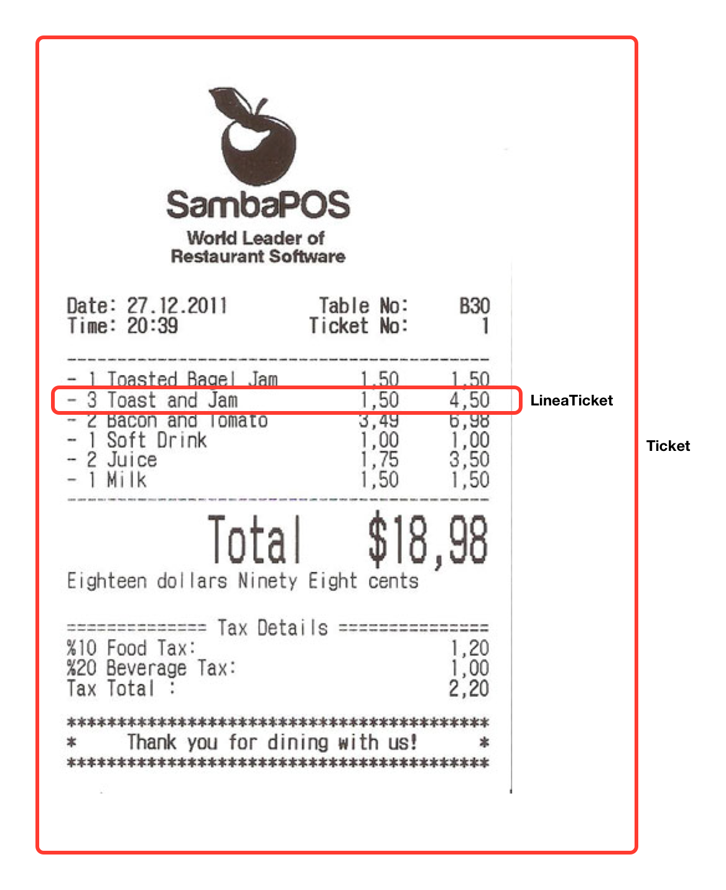

# Ejercicio 1 - Ticket

Diseña el diagrama de clases y escribe el programa para almacenar un ticket de supermercado, mediante las clases `Ticket` y `LineaTicket`.

Del ticket, pediremos al usuario la fecha, hora y número de ticket.

Por cada línea, el usuario introduce el nombre del producto, el precio por unidad y el número de unidades, sin límite, hasta que nos responda que ha terminado.

El programa sacará en pantalla:

- Los detalles generales del ticket.
- El listado con el nombre de cada producto, las unidades vendidas y el precio total. 
- El total que resulte de sumar todas las líneas del ticket.
